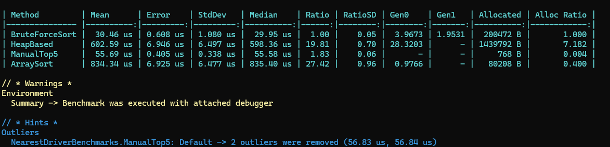

#DriverFinder - поиск ближайших водителей

##Результаты

Сравнение производительности 4-х алгоритмов на 10,000 водителей (карта 1000x1000).

###Выводы:

1. **BruteForceSort (LINQ)** — Самый быстрый алгоритм
2. **ManualTop5** — Лучший по потреблению памяти
3. **ArraySort** и **HeapBased** — показали себя хуже всего из-за высоких затрат памяти и времени

##Как запустить

1. Откройте `DriverFinder.slnx` в Visual Studio.
2. Переключите режим c Debug на Release.
3. Запустите проект `DriverFinder.Benchmarks` для измерения скорости.
4. Запустите тесты через `Ctrl + R, A`.